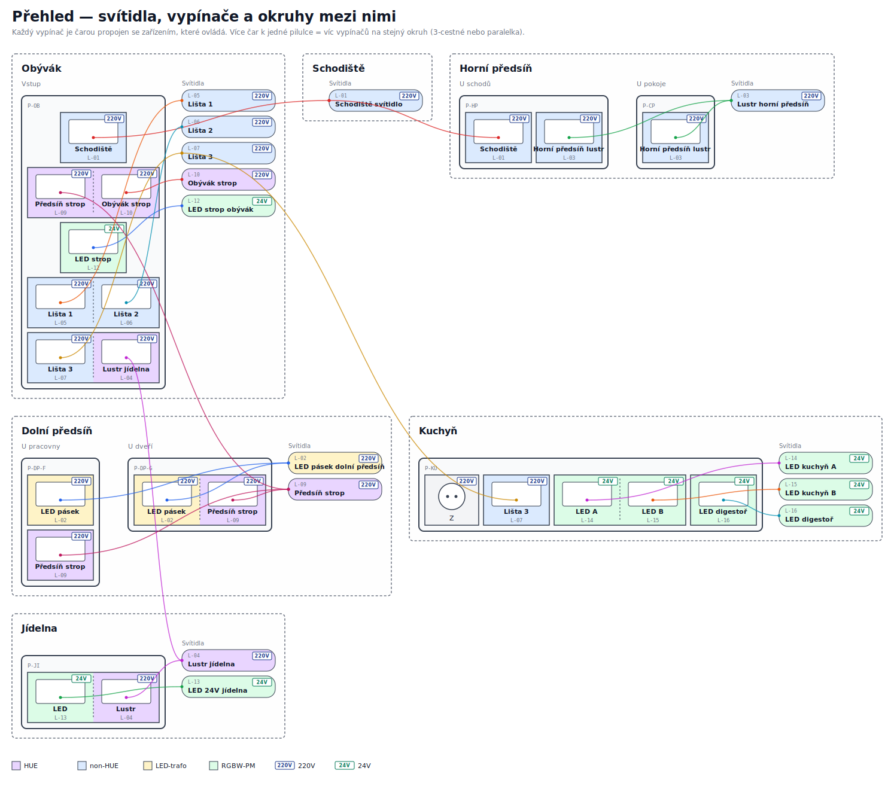

# Shelly instalace — specifikace pro elektrikáře

> Dokument určený elektrikářovi před zahájením prací. Začni tímto README a pokračuj do detailu per místnost.

## Celkový nákres



Čáry v přehledu spojují rámečky, které ovládají stejný okruh:
- **L-01** — 3-cestné ovládání schodiště (3 tlačítka v různých místnostech, propojeno přes HA)
- **L-02**, **L-09** — paralelky v dolní předsíni (přes stávající schodišťákové dráty)
- **L-03** — paralelka horní předsíň lustr

## Původní ručně psaný nákres

Pro referenci při instalaci:


## Co se instaluje

- **10 nových Shelly zařízení** (4× Plus 1PM, 2× Plus 2PM, 4× i4)
- **11 krabic** s vypínači nebo Shelly (z toho 2 krabice bez Shelly — jen WAGO propojení)
- **Odhad hardware:** ~7 600 Kč (viz kusovník níže)
- **14 světelných okruhů** celkem (11 nových/upravených + 3 stávající beze změny)

### Stávající zařízení (beze změny)

- **SH-E1** Shelly RGBW PM v obýváku (LED strop, L-12)
- **SH-E2** Shelly RGBW PM v jídelně (LED 24V, L-13)
- **SH-E3** kuchyně (24V systém, L-14) — v původním nákresu označeno _„vyřešeno"_, neřeší se

---

## Klíčové principy (MUSÍŠ VĚDĚT PŘED ZAČÁTKEM)

### 1. HUE okruhy vs. non-HUE okruhy

| Typ | Co to znamená | Zapojení |
|---|---|---|
| **HUE** | Stmívatelná Hue žárovka/pásek, fáze trvale pod proudem | Shelly **nikdy nespíná fázi**. Tlačítko jde jen do `i4` vstupu (**detached**) → HA → Hue bridge. |
| **non-HUE** | Klasický 230V okruh | Shelly Plus 1PM/2PM **spíná fázi**. Tlačítko do `SW` vstupu (**attached**), nebo do `i4` (**detached**). |

**Důsledek:** u HUE okruhů fázi žárovky **nikdy neodpojuj** — jinak se Hue žárovka „resetuje" do výchozího stavu po zapnutí.

### 2. Tlačítka, ne vypínače

Všechny nové vypínače jsou **ABB Tango s pružinkami = monostabilní tlačítka**. Posílají **eventy** (short / long / double press), ne stabilní ON/OFF stavy. Shelly je nakonfigurovaný na `button` režim, ne `switch`.

### 3. Attached vs. Detached

- **Attached:** tlačítko na `SW` vstupu Shelly přímo přepíná výstup. Funguje **offline bez HA**.
- **Detached:** tlačítko posílá jen event, Shelly nespíná automaticky. Výstup řídí HA automatizace. **Vyžaduje HA.**

### 4. Paralelní tlačítka (více míst, jeden okruh)

Dvě tlačítka z různých krabic jsou připojena paralelně na **jeden** `SW` vstup Shelly (přes stávající schodišťákové dráty). Shelly vidí „někdo stiskl" → toggle. Funguje offline.

Kde to je:
- **L-02** LED pásek — SW-F1 + SW-G1 → SH-02 SW1
- **L-03** horní předsíň lustr — SW-H2 + SW-H3 → SH-03 SW1
- **L-09** předsíň strop — SW-F2 + SW-G2 → SH-08 IN1

### 5. 3-cestné schodiště (L-01)

Tři tlačítka ve třech místnostech (obývák SW-A, horní předsíň SW-H1, chodba u pokoje SW-CP). Každé jde do lokální `i4` (SH-07/SH-09/SH-10) v **detached** režimu → HA → SH-01 přepne fázi. **Vyžaduje HA.**

### 6. Umístění Shelly — preferenčně u svítidel

Krabice za vypínači jsou **mělké** → nutno prosekat hlouběji nebo použít **KU68 prodlužovací kroužek**. Shelly proto umísťujeme do stropních krabic u svítidel, kde je místa dost, kdykoli to jde.

Krabice, kde se bude sekat / KU68:
- Obývák vstup (SH-05, SH-06, SH-07 — 3 Shelly ve dvou krabicích za SW-C, SW-D, SW-A+SW-B)
- Dolní předsíň u pracovny (SH-08)
- Horní předsíň u schodů (SH-09)
- Chodba u pokoje (SH-10)

---

## Kusovník (hardware)

| Ks | Položka | Orient. cena/ks | Σ |
|---:|---|---:|---:|
| 4 | Shelly Plus 1PM | 700 Kč | 2 800 Kč |
| 2 | Shelly Plus 2PM | 1 000 Kč | 2 000 Kč |
| 4 | Shelly i4 (230V) | 600 Kč | 2 400 Kč |
| — | KU68 prodlužovací kroužky | — | rezerva 400 Kč |
| — | WAGO svorky | — | rezerva ~ |
| | | **Celkem** | **~7 600 Kč** |

Vypínače ABB Tango (pružinkové tlačítkové moduly + rámečky) řeší zákazník samostatně.

---

## Per místnost (detailní rozpis)

Každý soubor obsahuje:
- Tabulku tlačítek s okruhy
- Které Shelly jsou v místnosti (a kam se montují)
- Instalační poznámky (mělkost krabic, zvláštnosti)
- SVG diagram rámečků

| Místnost | Rozpis | Diagram |
|---|---|---|
| Obývák | [rooms/01-obyvak.md](rooms/01-obyvak.md) | [plates/obyvak.svg](plates/obyvak.svg) |
| Dolní předsíň | [rooms/02-dolni-predsin.md](rooms/02-dolni-predsin.md) | [plates/dolni-predsin.svg](plates/dolni-predsin.svg) |
| Horní předsíň | [rooms/03-horni-predsin.md](rooms/03-horni-predsin.md) | [plates/horni-predsin.svg](plates/horni-predsin.svg) |
| Schodiště | [rooms/04-schodiste.md](rooms/04-schodiste.md) | (součást chodba/předsíň) |
| Chodba u pokoje | [rooms/05-chodba-u-pokoje.md](rooms/05-chodba-u-pokoje.md) | [plates/chodba-u-pokoje.svg](plates/chodba-u-pokoje.svg) |
| Jídelna | [rooms/06-jidelna.md](rooms/06-jidelna.md) | [plates/jidelna.svg](plates/jidelna.svg) |
| Kuchyň | [rooms/07-kuchyn.md](rooms/07-kuchyn.md) | [plates/kuchyn.svg](plates/kuchyn.svg) |

**Přehled všech rámečků pohromadě:** [plates/README.md](plates/README.md)

---

## Otevřené otázky

Před / během instalace nutno vyjasnit — viz [open-questions.md](open-questions.md). Vybrané:

- Ověřit průchodnost stávajících schodišťákových drátů (u paralelek L-02, L-03, L-09)
- Ověřit hloubku krabic za SW-A+B, SW-C, SW-D, SW-H1+H2, SW-F1+F2, SW-CP
- Tolerance trafa LED pásku ke spínání 230V primáru (L-02)
- Fyzické rozmístění SW-A vs. SW-B — vejde se SH-07 i4 do jedné krabice?

---

## Struktura projektu (orientace v dokumentech)

```
shelly-projekt/
├── README.md                    # ← Tento soubor (pro elektrikáře, začni tady)
├── sources/nakres-puvodni.png   # Původní ručně psaný nákres
├── plates/prehled.svg           # Celkový digitální nákres (propojení okruhů)
├── plates/<místnost>.svg        # Detail per místnost
├── rooms/<NN>-<místnost>.md     # Detailní rozpis pro elektrikáře per místnost
├── devices/
│   ├── shelly.yaml              # Inventář Shelly (SH-01..10, SH-E*)
│   ├── circuits.yaml            # Světelné okruhy (L-01..14)
│   ├── switches.yaml            # Vypínače a tlačítka (SW-*)
│   └── plates.yaml              # Fyzické rámečky na stěnách (P-*)
├── ha/automations.md            # Home Assistant (HA) automatizace — draft
├── open-questions.md            # Otevřené body k ověření
├── changelog.md                 # Historie změn specifikace
└── scripts/generate_plates.py   # Generátor SVG diagramů
```

**Konvence ID:**
- `SH-XX` = Shelly zařízení (`SH-E*` = stávající)
- `L-XX` = světelný okruh
- `SW-X` = vypínač/tlačítko
- `P-XX` = rámeček na stěně

---

## Stav

**DRAFT v0.1** — průběžně laděno. Viz [changelog.md](changelog.md).
