# Rámečky — digitální nákres

Generováno z `devices/plates.yaml` skriptem `scripts/generate_plates.py`.

## Přehled (plánovaný stav)

## Stav po úpravě (s namontovanými Shelly)

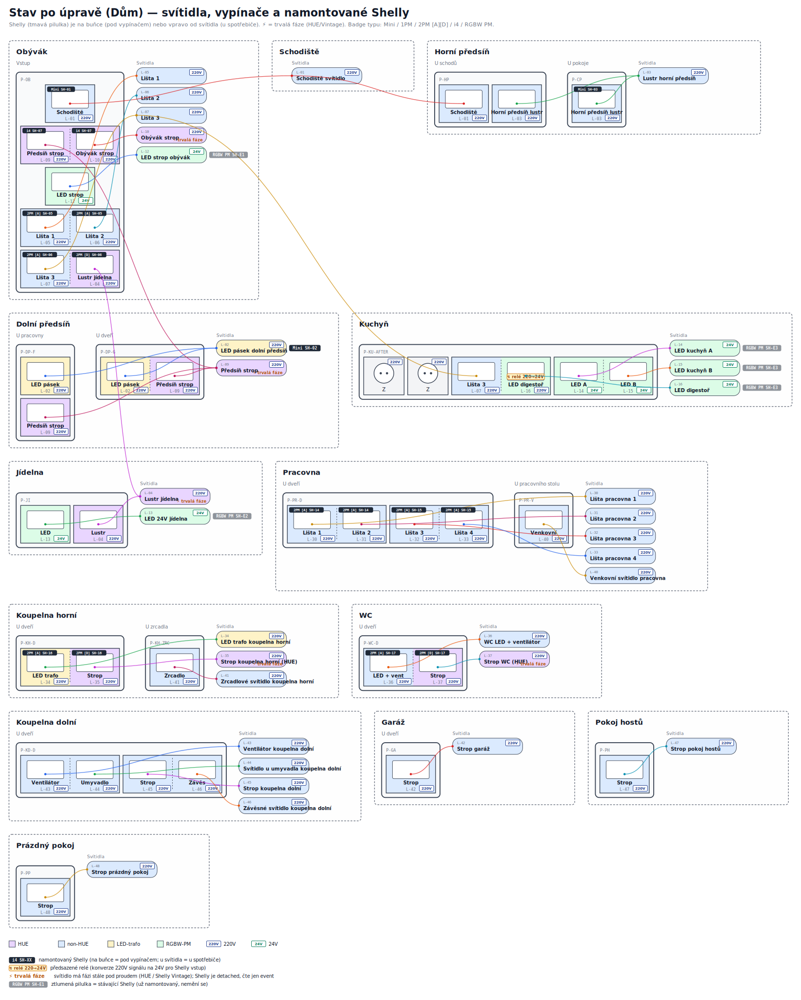

## Ložnice (samostatný okruh dokumentace)

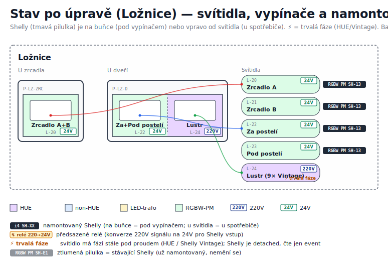

## Detail per místnost

### Dolní předsíň

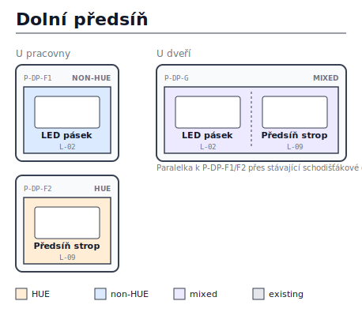

### Garáž

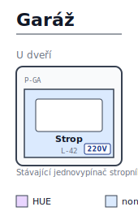

### Horní předsíň

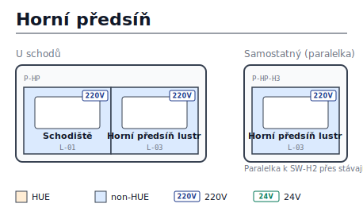

### Jídelna

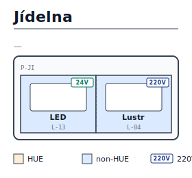

### Koupelna dolní

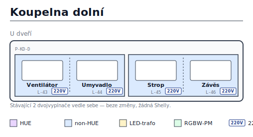

### Koupelna horní

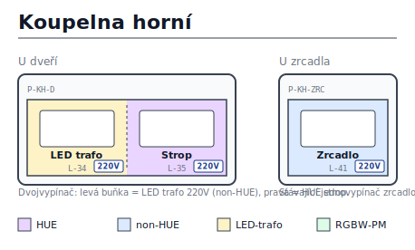

### Kuchyň

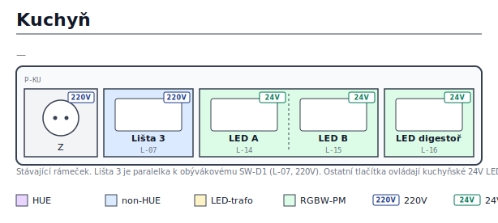

### Obývák

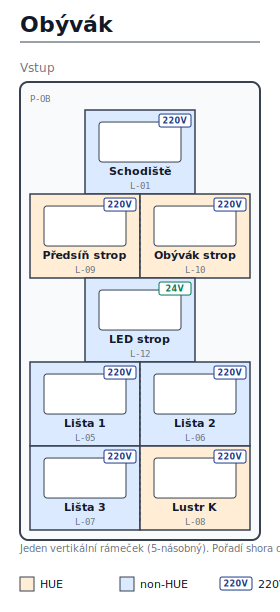

### Pokoj hostů

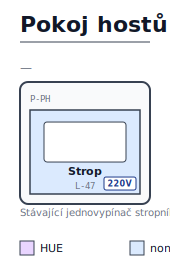

### Pracovna

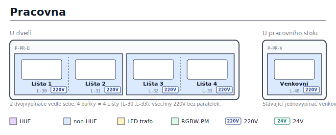

### Prázdný pokoj

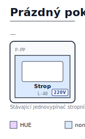

### WC

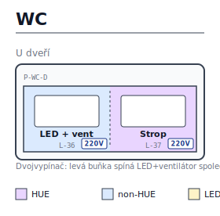
